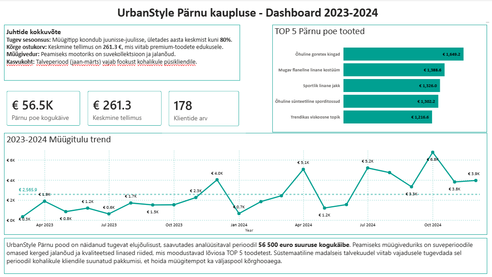

# UrbanStyle Pärnu kaupluse müügianalüüs (2023-2024)

## Projekti ülevaade
Antud projekt on koostatud Power BI-s, et analüüsida UrbanStyle Pärnu esinduskaupluse müügitulemusi ja trende perioodil 2023-2024. Dashboard annab kiire ülevaate kaupluse tervisest, klientide arvust ja peamistest müügiartiklitest.

## Peamised mõõdikud (KPI-d)
* **Kogukäive:** € 56.5K
* **Keskmine tellimus:** € 261.3 (viitab premium-toodete edukusele)
* **Klientide arv:** 178

## Analüüsi tulemused
* **Tugev sesoonsus:** Müügitipp koondub suveperioodile (juuni-juuli), kus müük ületab aasta keskmist kuni 80%.
* **Tooteportfell:** Peamisteks müügiveduriteks on suvekollektsioon – eriti linased riided ja kerged jalanõud (TOP tooted: õhulised goretex kingad ja flanellne linane kostüüm).
* **Kasvukoht:** Analüüs tuvastas madalseisu talvekuudel (jaanuar-märts), mis viitab vajadusele tugevdada sel perioodil turundustegevusi kohalikule püsikliendile.

## Kasutatud tehnoloogiad
* Power BI Desktop
* Andmete modelleerimine ja puhastamine
* Visualiseerimine (Line charts, Card visuals, Bar charts)

